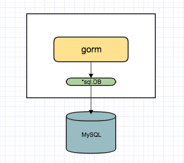
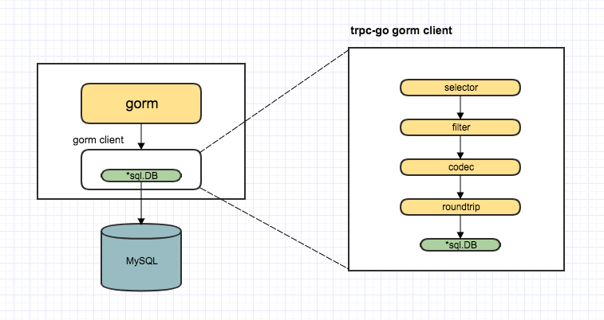

# Implementation Details

## Implementation Approach

The overall implementation of gorm is as follows:



**gorm interacts with the database through the `*sql.DB` library.**
gorm also supports custom database connection extensions, as mentioned in the official documentation:

[GORM allows initializing *gorm.DB with an existing database connection](https://gorm.io/docs/connecting_to_the_database.html)

So the implementation logic is as follows:



The plugin acts as a bridge between gorm and the tRPC framework, implementing the ConnPool interface that gorm expects while routing all database operations through tRPC's client infrastructure.

## Specific Implementation

### Package Structure
```
gorm/
├── client.go      # Entry point for using this plugin
├── codec.go       # Encoding and decoding module  
├── plugin.go      # Implementation of plugin configuration
├── transport.go   # Actual data sending and receiving
└── docs/
    └── architecture.md # This documentation
```

### client.go Logic Explanation

The Client struct corresponding to ConnPool is defined as follows:

```go
// Client encapsulates trpc client
type Client struct {
    ServiceName string
    Client      client.Client
    opts        []client.Option
}
```

Client implements the following methods:

```go
//======== ConnPool interface related methods
func (gc *Client) PrepareContext(ctx context.Context, query string) (*sql.Stmt, error)
func (gc *Client) ExecContext(ctx context.Context, query string, args ...interface{}) (sql.Result, error)
func (gc *Client) QueryContext(ctx context.Context, query string, args ...interface{}) (*sql.Rows, error)
func (gc *Client) QueryRowContext(ctx context.Context, query string, args ...interface{}) *sql.Row
func (gc *Client) BeginTx(ctx context.Context, opts *sql.TxOptions) (*sql.Tx, error)

//======== ConnPoolBeginner interface related methods
func (gc *Client) BeginTx(ctx context.Context, opts *sql.TxOptions) (gorm.ConnPool, error)

//======== Ping method
func (gc *Client) Ping()

// ======== GetDBConnector interface related methods
func (gc *Client) GetDBConn() (*sql.DB, error)
```

In the gorm framework, all interactions with the DB are done through the DB.ConnPool field. ConnPool is an interface type, so as long as our Client implements all methods of ConnPool, gorm can use the Client to interact with the DB.

The definition of ConnPool can be found here: [gorm ConnPool](https://github.com/go-gorm/gorm/blob/master/interfaces.go)

After practical usage, it was found that implementing only the ConnPool methods in gormCli is not sufficient. For example, it was not possible to interact with the database using transactions. Therefore, a comprehensive code search was performed to identify all the methods in gorm that call ConnPool, and they were implemented accordingly. Search method: using `type assertion` .ConnPool.( to search the code.

At this point, the Client becomes a `custom connection` that satisfies gorm's requirements, similar to sql.DB, but implementing only a subset of sql.DB functionality.

Additionally, there is a TxClient used for transaction handling, which implements both the ConnPool and TxCommitter interfaces defined by gorm.

### transport.go Logic Explanation

This is implemented using a method similar to trpc-database/sql, encapsulating the final step of sending requests outward. Here, db is the sql driver from `go-sql-driver`.

```go
func (ct *ClientTransport) RoundTrip(ctx context.Context, reqBuf []byte,
    // The front part is basically the same as the trpc-go mysql client RoundTrip method
    ...
    // Call the corresponding method of *sql.DB based on the Op in the request parameters, then return the result
    switch sqlReq.Op {
    case OpPrepareContext:
        stmt, err := db.PrepareContext(ctx, sqlReq.Query)
        if err != nil {
            return nil, err
        }
        sqlRsp.Stmt = stmt

    case OpExecContext:
        result, err := db.ExecContext(ctx, sqlReq.Query, sqlReq.Args...)
        if err != nil {
            return nil, err
        }
        sqlRsp.Result = result
    ...
```